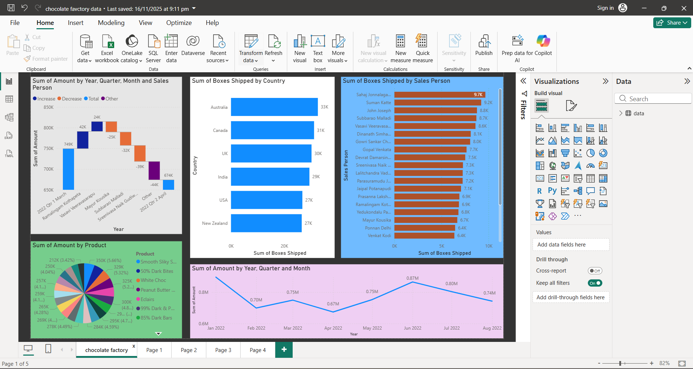

#  ADDALA SEKHAR TRIMURTHULU – Data Analyst Portfolio

Welcome to my data analytics portfolio. I am an entry-level Data Analyst skilled in **Power BI, Excel, SQL, and Python**.

---

##  Featured Project: Power BI Business Insights Dashboards

**Tools:** Power BI, DAX, Power Query  

- Built two dashboards: **Electronics Sales** and **Chocolate Factory KPIs**.  
- Created KPIs like **Total Sales, Units Sold, Boxes Shipped, Salesperson Ranking, Country-wise Shipments**.  
- Used **DAX measures** for YTD, Monthly KPIs, and rankings.  
- Cleaned and transformed raw data using **Power Query**.  
- Added **slicers and drill-through** for interactive analysis.

---
---

## 📊 Electronics Sales Dashboard

## 🍫 Chocolate Factory Dashboard

##  Diesel Engine Biodiesel Analysis (Excel + Python)

**Tools:** Excel, Python (Pandas, Matplotlib)  

- Analyzed engine performance using biodiesel vs diesel.  
- Calculated efficiency and plotted graphs.  
- Used Excel formulas and charts for visualization.

---

##  Python Mini Projects

**Tools:** Python  

- Calculator  
- Loan Eligibility Checker  
- Stopwatch  

These projects helped me improve logic building, debugging, and accuracy.

---

##  Skills

- **BI & Visualization:** Power BI (Dashboards, DAX, Power Query), Tableau (Basic)  
- **Data Analysis:** Excel (Pivot Tables, VLOOKUP, Charts)  
- **Databases:** SQL (Joins, Aggregations)  
- **Programming:** Python (Pandas, NumPy)  

---

##  Contact

- **Email:** sekharaddala03@gmail.com  
- **Phone:** 7997458914  
- **LinkedIn:** www.linkedin.com/in/
sekhar-trimurthulu-869ab12b2
 

